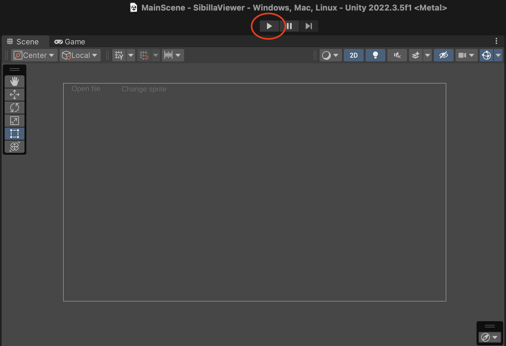
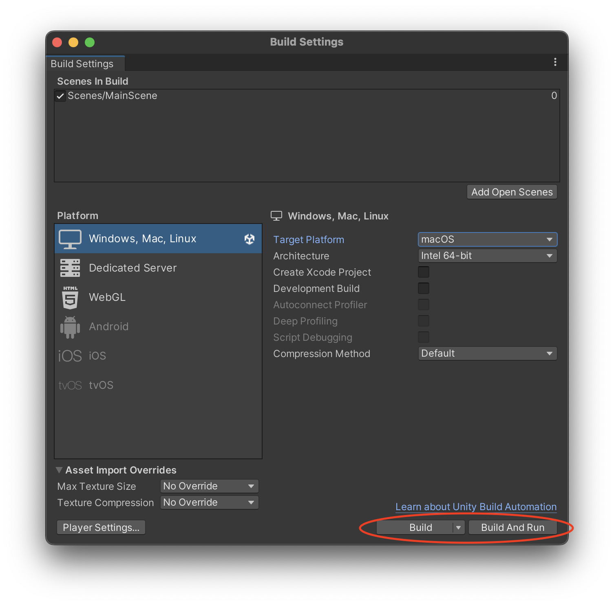
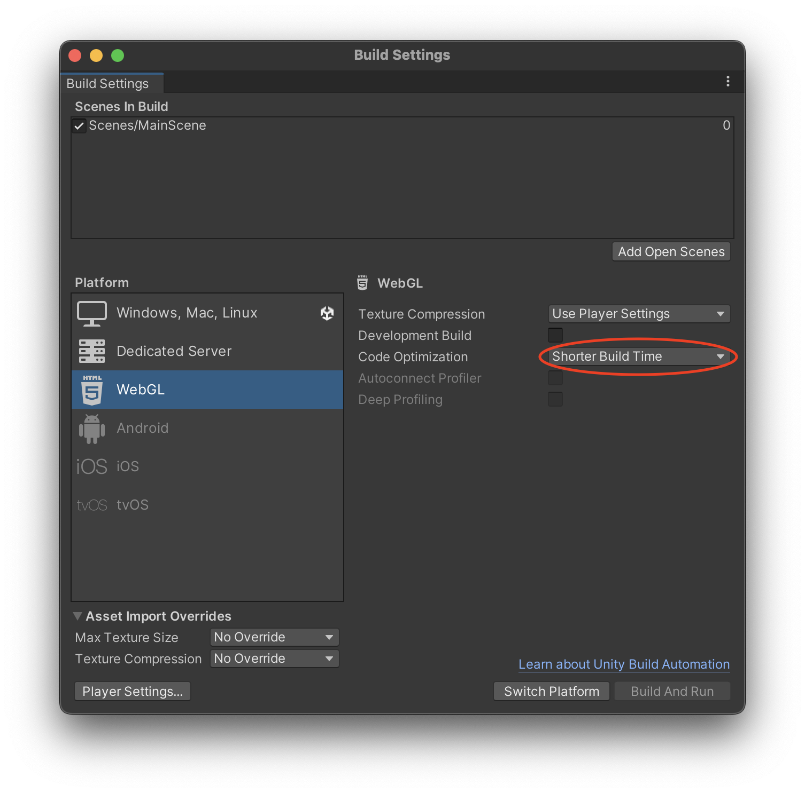
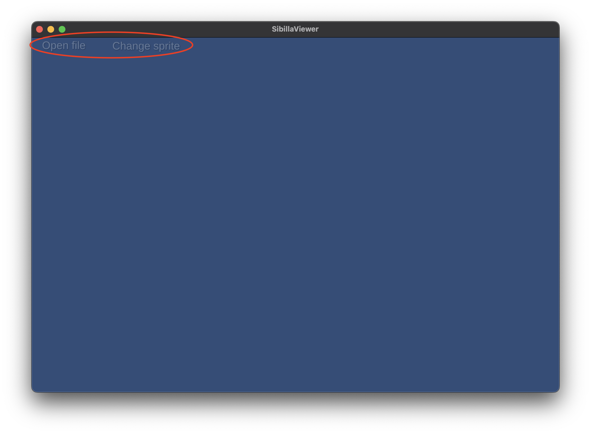

# SibillaViewer

This is a thesis project for the bachelor degree in Computer Science at 
[Università degli Studi di Camerino](http://www.unicam.it/)

## Building and running

To work with the project you need to have the Unity Editor installed, it can be downloaded 
through the [Unity Hub](https://unity.com/download). This project was created using
version 2022.3.5f1 LTS.

The application can be run in two different ways:

### 1. Run in the Editor

To run the application directly in the Unity Editor, press the "Play" button above the 
scene view, the execution can then be stopped via the "Stop" button in the same position.

### 2. Build and run for a platform

To build a native version of the project, open the Build Settings window under 
**File > Build Settings** then select the platform you wish to build for and press
either "Build" or "Build And Run".

> Currently only Windows, macOS and WebGL have been tested

#### The WebGL version

The WebGL build can only be executed from an HTTPS web server, of which the Editor creates 
an instance when clicking on "Build And Run" so it is recommended to use that option. Also
the building process for WebGL is quite long, so the "Code Optimization" setting should be
set on "Shorter Build Time" when testing.

## Usage

The tool currently only has two functions, executed via the two buttons in the UI:

- **Open file**: Opens the file chooser window to load a new agent file, it has to be in
*csv* format with only three columns representing the time and the X and Y coordinates
- **Change sprite**: Allows to change the sprite of an agent by selecting a *png* file

